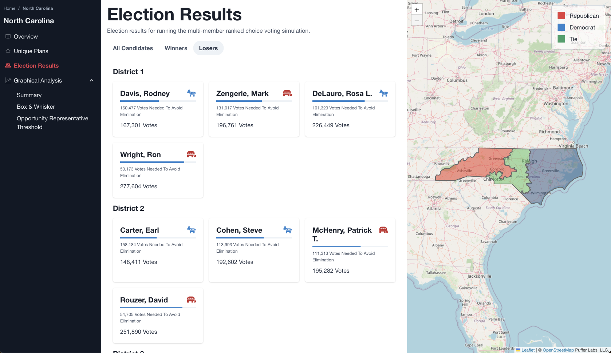
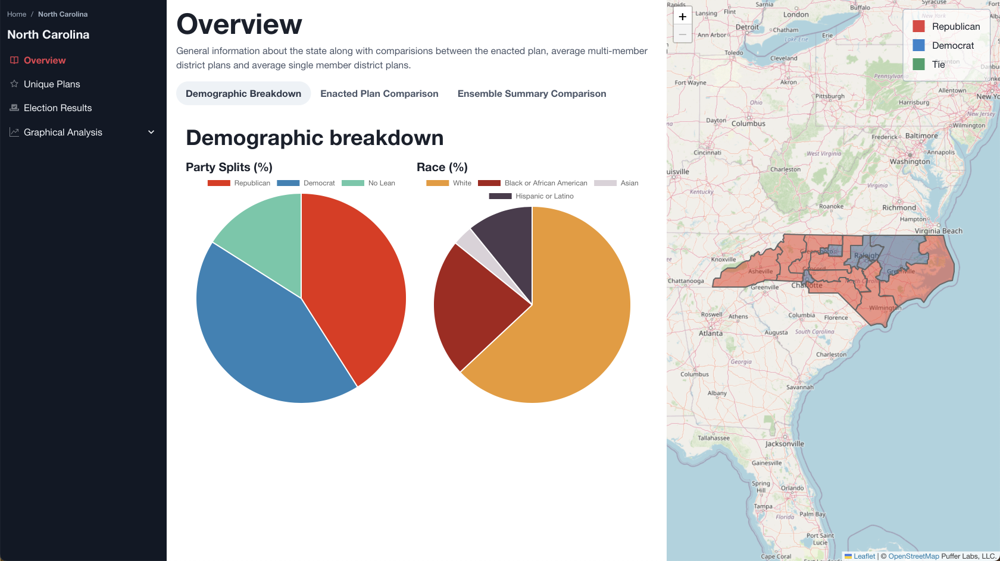
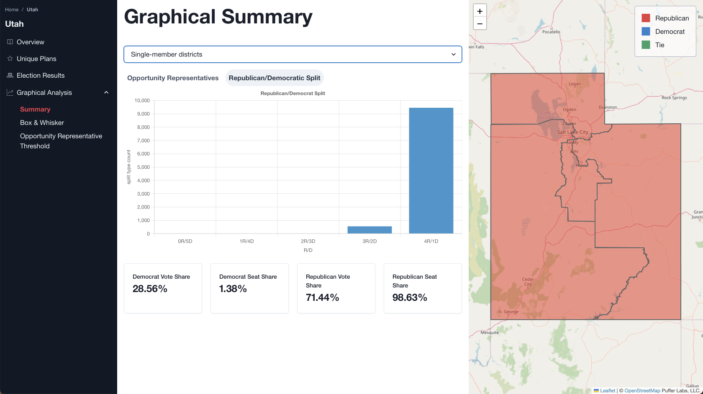
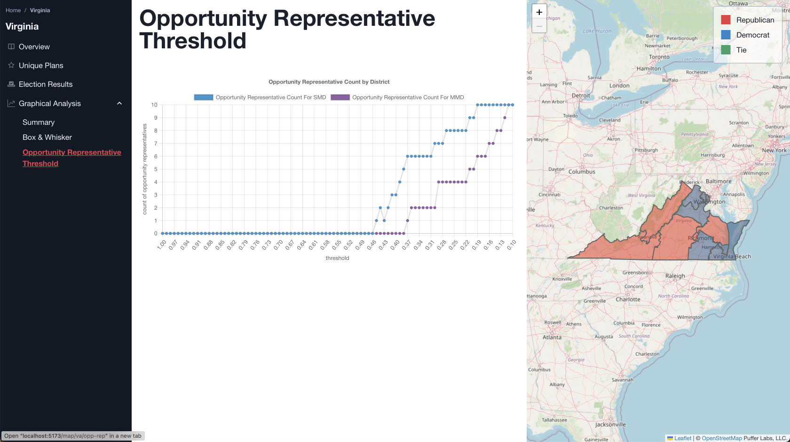
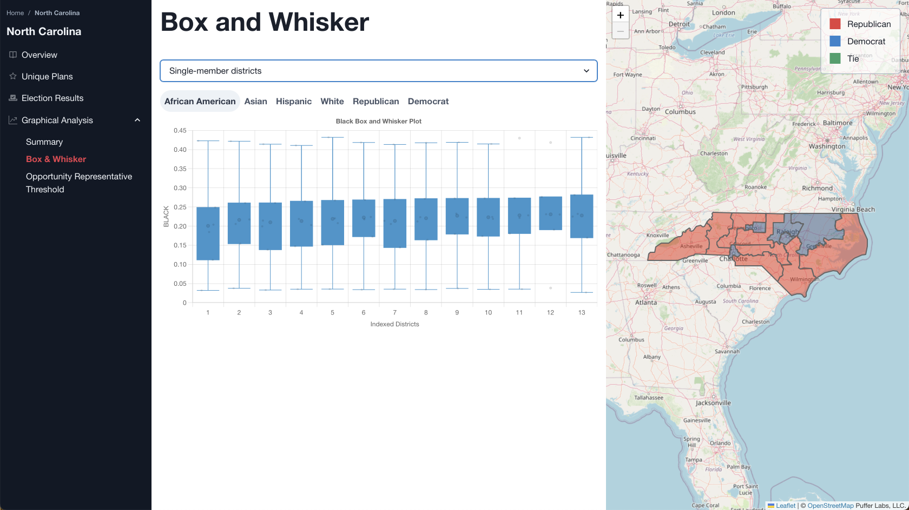

[![Contributors][contributors-shield]][contributors-url]
[![MIT License][license-shield]][license-url]

<!-- PROJECT LOGO -->
 

    

  <h3 align="center">States Redistricter</h3>

  

	Simulation of the H.R.3863 bill
     
    <a href="https://www.congress.gov/bill/117th-congress/house-bill/3863"><strong>View the bill »</strong></a>
  

# About The Project

<!-- Put image of webpage in assets folder -->

This project aims to simulate the effects of redistricting on election outcomes using a multi-member ranked choice voting algorithm. The ranked choice voting algorithm allows voters to rank their preferences among multiple candidates, and then uses these preferences to determine the winners in a fair and proportional way. In this project, we use the ranked choice voting algorithm to simulate elections in different states under different redistricting scenarios, and analyze the results to see how redistricting can influence the balance of power in a state's congressional delegation.

## Built With

- [![React][react.js]][react-url]
- [![Spring][spring]][spring-url]
- [![Jupyter][jupyter]][jupyter-url]
- [![MongoDB][mongodb]][mongodb-url]

## Screenshots

### Overview

### Graphical Analysis

### Opportunity District Threshold Analysis

### Box and Whisker

## License

Distributed under the MIT License.

<!-- CONTACT -->

## Sources

- [MGGG](https://mggg.org/)
- [Redistring Data Hub](https://redistrictingdatahub.org)
- [H.R.3863](https://www.congress.gov/bill/117th-congress/house-bill/3863)
- [Congressional Members](https://www.congress.gov/members)
- [Harvard Election Data Archive](https://dataverse.harvard.edu/dataverse/medsl)

[contributors-shield]: https://img.shields.io/github/contributors/nimatullo/416.svg?style=for-the-badge
[contributors-url]: https://github.com/nimatullo/416/graphs/contributors
[license-shield]: https://img.shields.io/github/license/othneildrew/Best-README-Template.svg?style=for-the-badge
[license-url]: https://github.com/othneildrew/Best-README-Template/blob/master/LICENSE.txt
[react.js]: https://img.shields.io/badge/React-20232A?style=for-the-badge&logo=react&logoColor=61DAFB
[react-url]: https://reactjs.org/
[spring]: https://img.shields.io/badge/Spring-6DB33F?style=for-the-badge&logo=spring&logoColor=white
[spring-url]: https://spring.io/
[jupyter]: https://img.shields.io/badge/Jupyter-F37626?style=for-the-badge&logo=Jupyter&logoColor=white
[jupyter-url]: https://jupyter.org/
[mongodb]: https://img.shields.io/badge/MongoDB-4EA94B?style=for-the-badge&logo=MongoDB&logoColor=white
[mongodb-url]: https://www.mongodb.com/
